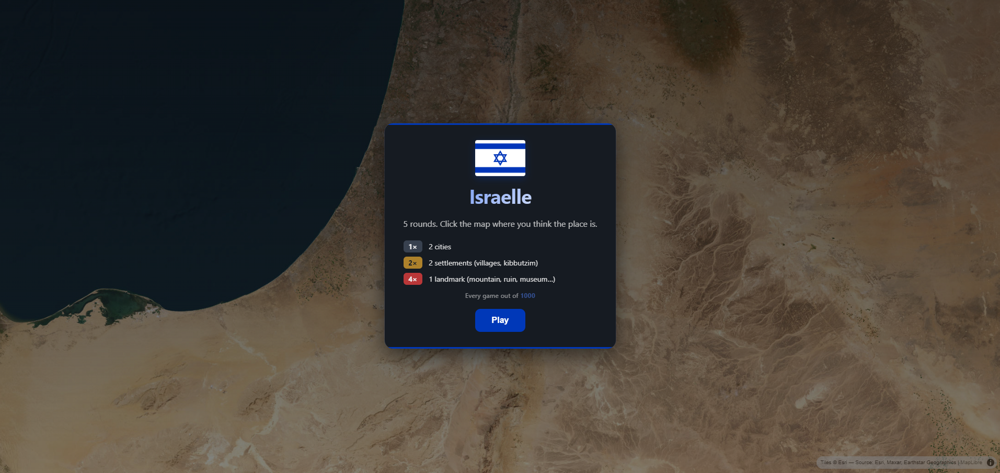

<div align="center">

# 🇮🇱 IsraelE

**A Wordle-style daily geography game scoped to Israel.**
6 places a day, same set for everyone. Click the satellite map where you think each place is. Closer = more points. Up to **1000** points per day.

[**Play → israel-e.com**](https://israel-e.com)




</div>

---

## How it works

- **6 rounds per day**, identical set for every player. Resets at 00:00 Israel time.
- 2 cities + 2 settlements + 2 landmarks per puzzle, picked server-side.
- Each round shows a Hebrew place name; you tap the satellite map.
- Score per round = `base × multiplier` — max **1000** total per day.

### Scoring

Quadratic falloff — wrong-end-of-country guesses are basically worthless.

| Distance | Base | Notes |
|---:|---:|---|
| 0–1 km | **100** | bullseye |
| 10 km | 92 | close |
| 50 km | 64 | wrong neighborhood |
| 100 km | 36 | wrong region |
| 200 km | 4 | trivial |
| 250 km+ | **0** | giving up |

Multiplier depends on the category:

| Category | Multiplier | Examples |
|---|:-:|---|
| City | **1×** | Tel Aviv, Jerusalem, Haifa, Eilat |
| Settlement | **1.5×** | villages, kibbutzim, moshavim |
| Landmark | **2.5×** | mountains, museums, archaeological sites, monuments… |

## Stack

| Layer | Choice |
|---|---|
| Backend | FastAPI + uvicorn on **Railway** (Nixpacks) |
| Frontend | Static HTML/JS/CSS on **Vercel** (`/api/*` proxied to Railway) |
| DB + Auth | **Supabase** Postgres + PostgREST + Google OAuth + RLS |
| Domain | **Cloudflare** DNS → `israel-e.com` (Vercel TLS) |
| Map engine | [MapLibre GL JS](https://maplibre.org/) (WebGL) |
| Basemap | [Esri World Imagery](https://server.arcgisonline.com/ArcGIS/rest/services/World_Imagery/MapServer) — free, z19, no API key |
| Border data | [geoBoundaries gbOpen](https://www.geoboundaries.org/) (Israel + Palestine ADM0, unioned) |
| Place data | OpenStreetMap via [Overpass API](https://overpass-api.de) — one-shot fetch → committed CSV |

## Local dev

```bash
git clone https://github.com/roeimichael/israelle
cd israelle
python -m venv .venv
.venv/Scripts/activate                  # Windows
# source .venv/bin/activate              # macOS / Linux
pip install -r backend/requirements.txt
# Required env (mirror what Railway has):
# SUPABASE_URL, SUPABASE_KEY (publishable / anon), ALLOWED_ORIGINS, SERVE_FRONTEND=1
uvicorn backend.main:app --host 127.0.0.1 --port 8000
```

Set `SERVE_FRONTEND=1` so the backend mounts `frontend/` at `/` for single-origin local play. In production this is off — Vercel owns the frontend.

Open **http://127.0.0.1:8000** → click *Play*.

## Deploy

See [`docs/MIGRATION.md`](docs/MIGRATION.md) for the full Railway + Vercel + Cloudflare + Supabase + Google OAuth setup. Every push to `main` redeploys both Railway (backend) and Vercel (frontend) automatically.

## Repo layout

```
backend/        FastAPI app — routes, scoring, place loader, supabase client
frontend/       index.html, app.js, style.css (vanilla, no build step)
scripts/        one-shot data ETL (Overpass + geoBoundaries fetch, merge)
data/           places.csv (~3.3k entries), polygons.json, israel.geojson
docs/           screenshots, migration guide
nixpacks.toml   Railway build config (venv + uvicorn entrypoint)
railway.json    Railway deploy config (Nixpacks, restart-on-failure)
vercel.json     Vercel static deploy + /api/* rewrite to Railway
```

## API (used by the frontend)

| Method | Path | Returns |
|---|---|---|
| `GET` | `/api/today` | `{date, day_number, rounds: [6], tile_hash}` |
| `GET` | `/api/me/today` | (auth) signed-in user's today state |
| `GET` | `/api/today/me?player_id=...` | guest's today state |
| `POST` | `/api/today/guess` | scores a guess, persists, returns reveal payload |
| `GET` | `/api/me/history` | (auth) last 60 games |
| `GET` | `/api/me/stats?player_id=...` | streaks + histogram |
| `GET` | `/api/leaderboard?date=...` | top 20 for the day |
| `GET` | `/api/israel-border` | land-only Israel+PSE polygon (13.5k pts) |
| `GET` | `/api/config` | Supabase URL + publishable key for the browser |

## Rebuilding the place data

Shipped `data/places.csv` is enough to play. To refresh:

```bash
pip install -r scripts/requirements.txt
python scripts/fetch_overpass.py        # writes data/raw/overpass.json
python scripts/fetch_israel_border.py   # rebuilds data/israel.geojson
python scripts/build_places.py          # merges → data/places.csv
```

## License

MIT — see [LICENSE](LICENSE).

Map data © OpenStreetMap contributors. Borders © geoBoundaries (CC-BY 4.0). Satellite imagery © Esri.
